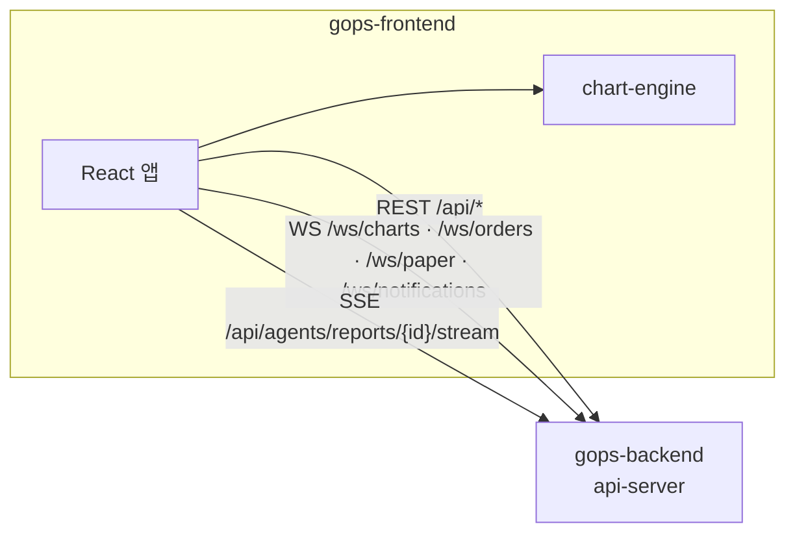

# 📈 GOPS Frontend

> **종목을 찾는 사람에게 기준을, 시장을 읽는 사람에게 방향을.**

GOPS는 실시간 미국 주식(S&P 500) 시장 데이터, 기업 관계 맥락, 역할별 AI 에이전트를 하나의
트레이딩 워크스페이스로 묶은 플랫폼입니다.<br>
이 저장소는 **증시지도·차트 워크스페이스·AI 에이전트 UI**를 담당하는 React 프론트엔드입니다.
백엔드는 [GOPS-BE](https://github.com/seunglee10/GOPS-BE)에 있습니다.

## 목차

| 번호 | 섹션 | 설명 |
|:---:|:---|:---|
| **1** | [프로젝트 개요](#프로젝트-개요) | 프로젝트 소개 및 개발 목적 |
| **2** | [주요 기능](#주요-기능) | 핵심 화면 및 특징 |
| **3** | [트러블 슈팅](#트러블-슈팅) | 개발 중 발생한 문제와 해결 과정 |
| **4** | [시스템 아키텍처](#시스템-아키텍처) | 기술 스택과 백엔드 통신 구조 |
| **5** | [디자인 시스템](#디자인-시스템) | 토큰·테마·타이포그래피 원칙 |
| **6** | [프로젝트 구조](#프로젝트-구조) | 코드 구조 |
| **7** | [실행 방법](#실행-방법) | 로컬 환경 실행 가이드 |
| **8** | [테스트](#테스트) | 테스트 스위트와 CI |

<br>

## 프로젝트 개요

GOPS의 첫 화면은 랜딩 페이지가 아니라 **제품 그 자체**입니다. 화면 전체를 증시지도나 차트 캔버스로 쓰고,
그 위에 필요한 패널을 붙였다 떼며 분석합니다. 하단 에이전트 바에 자연어로 질문하면
AI가 분석 리포트를 스트리밍하고, 차트 명령과 패널 배치까지 제안합니다.

프론트엔드는 다음에 집중했습니다.

- **밀도 높은 실시간 화면**: 수백 종목의 시세를 Canvas 2D로 직접 그려 DOM 부담 없이 갱신합니다.
  차트는 자체 엔진([`@gops/chart-engine`](packages/chart-engine/))으로 구현했습니다.
- **조립 가능한 워크스페이스**: 40여 종의 패널을 그리드에 배치하고, 프리셋으로 저장·복원합니다.
- **일관된 디자인 시스템**: 모든 색·간격·타이포그래피를 토큰으로 관리하고 라이트/다크 테마를 지원합니다.

<br>

## 주요 기능

- **증시지도**: S&P 500 전 종목을 섹터별 트리맵으로 보여줍니다. Canvas로 렌더링합니다.
- **차트 워크스페이스**: 캔들·보조지표·드로잉 도구·분석 자산 레이어·이벤트 오버레이·체결 마커·비교 차트.
  WebSocket으로 실시간 캔들을 받습니다.
- **패널 시스템**: 차트 해설, 기업정보·가치평가, 뉴스, 지수, 온톨로지 그래프(d3 force), 추천,
  포트폴리오, 오더플로우, AI 투자 코치 등 40여 종. 그리드 배치와 레이아웃 프리셋을 지원합니다.
- **AI 에이전트**: 하단 커맨드 바에서 질문하면 분석 리포트를 SSE로 스트리밍하고, 차트 명령과 레이아웃 제안을 반영합니다.
- **주문·가상계좌**: 주문 티켓, 빠른 주문, 가상계좌 잔고·체결을 WebSocket으로 실시간 표시합니다.
- **틱 리플레이 시뮬레이터**: 과거 장을 1×·2×·5×·10× 배속으로 재생합니다. 운영자 계정만 제어할 수 있습니다.
- **추천·알림**: 투자 성향 설정 기반 종목 추천, 토스트·알림 센터.
- **테마**: Light → Dark → System 순환 토글. 새로고침 시 첫 페인트 전에 테마를 적용합니다.
- **소셜 로그인**: Google, Kakao.

<br>

## 트러블 슈팅

| Category | Topic | 원인과 해결 |
| :--- | :--- | :--- |
| **Theme** | **테마 전환 시 캔버스가 갱신되지 않음** | 차트·트리맵·오더플로우는 Canvas라서 CSS가 바뀌어도 다시 그려지지 않습니다. 캔버스가 매 draw마다 CSS 변수를 읽게 하고, 전환 시점에 리드로우만 걸었습니다. 훅 컴포넌트는 `useThemeVersion`을 deps에 넣고, 명령형 렌더 루프는 `subscribeThemeChange`를 구독합니다. [`8a11bf6`](https://github.com/seunglee10/GOPS-FE/commit/8a11bf6) |
| | **새로고침 시 라이트 테마 깜빡임** | React가 마운트되기 전에 기본 테마가 먼저 그려졌습니다. `index.html` 인라인 스크립트가 첫 페인트 전에 `data-theme`를 세팅합니다. [`8a11bf6`](https://github.com/seunglee10/GOPS-FE/commit/8a11bf6) |
| | **흩어진 색 팔레트** | 기능마다 지역 팔레트를 따로 두어 compare-cockpit 한 곳에만 156개의 복제 색이 있었습니다. 원시 토큰만 테마별로 나누고 파생 토큰 200여 개가 따라오게 했으며, 근접 중복 값을 정리했습니다. [`7dbc966`](https://github.com/seunglee10/GOPS-FE/commit/7dbc966) |
| **Performance** | **보조지표 표시 지연** | SMA는 캔들 응답의 값을 바로 쓰고 EMA·RSI 등만 별도 계산 요청으로 분리했습니다. [`6fc31df`](https://github.com/seunglee10/GOPS-FE/commit/6fc31df) |
| | **실시간 차트 경로 병목** | 데이터 채우기와 실시간 렌더링이 서로를 막지 않게 분리하고, 마감된 캔들 워터마크로 늦게 도착한 live 데이터를 차단했습니다. [`8c7e51e`](https://github.com/seunglee10/GOPS-FE/commit/8c7e51e) · [`e36e5de`](https://github.com/seunglee10/GOPS-FE/commit/e36e5de) · [`1162fd0`](https://github.com/seunglee10/GOPS-FE/commit/1162fd0) |
| | **SIM 재생·가상계좌 병목** | 프론트에서 요청을 병합하고 WebSocket을 자동 재연결해 일시 장애에서 스스로 복구합니다. [`a294993`](https://github.com/seunglee10/GOPS-FE/commit/a294993) |
| | **증시지도 로딩 지연** | stale 히트맵을 즉시 보여주고 갱신은 하나로 묶었으며, 응답을 렌더링 필드로 줄였습니다. [`430ebeb`](https://github.com/seunglee10/GOPS-FE/commit/430ebeb) · [`51e9f2a`](https://github.com/seunglee10/GOPS-FE/commit/51e9f2a) |
| **Build** | **청크 순환 참조** | `manualChunks` 폴더 규칙이 다른 도메인 패널을 엉뚱한 기능 청크로 끌어가 순환이 생겼습니다. 해당 패널을 엔트리 청크에 명시적으로 남겼습니다. [vite.config.ts](vite.config.ts) |
| | **배포 후 빈 화면** | 배포 뒤 이전 빌드의 자산을 참조해 화면이 비는 문제를 막았습니다. [`7c07693`](https://github.com/seunglee10/GOPS-FE/commit/7c07693) |
| **Refactor** | **복사된 파싱 가드** | 같은 JSON 파싱 가드가 18개 파일에 복사돼 있었습니다. 본문이 완전히 같은 함수만 `src/shared/json.ts`로 합치고, 사본마다 동작이 다른 함수는 건드리지 않았습니다. [`cd57ff3`](https://github.com/seunglee10/GOPS-FE/commit/cd57ff3) |

<br>

## 시스템 아키텍처

| 카테고리 | 기술 | 설명 |
|:---|:---|:---|
| **Framework** | React 19 + TypeScript 5.7 | UI |
| **Build** | Vite 6 | 개발 서버, 도메인 단위 청크 분리 |
| **Chart** | 자체 Canvas 2D 엔진 (`@gops/chart-engine`) | 캔들·지표·드로잉·뷰포트 |
| **Visualization** | d3 7 | 온톨로지 force 그래프 |
| **State** | React Context + 모듈 스토어 | 외부 상태 라이브러리 없음 |
| **Styling** | CSS 커스텀 프로퍼티 토큰 + CSS Modules | [DESIGN.md](DESIGN.md) 기준 |
| **Realtime** | WebSocket, SSE | 시세·주문·알림, 에이전트 리포트 |
| **Test** | node:test, Playwright | 단위 테스트, 데스크톱·모바일 시각 회귀 |
| **Deploy** | Docker (nginx), GitHub Actions → ECR → EKS | `dev` 푸시 시 자동 배포 |



| 통신 | 용도 | 코드 |
| :--- | :--- | :--- |
| **REST** | 차트·시장·추천·주문·기업저널 등 | `/api/*` |
| **WebSocket** | 실시간 캔들 | [src/chart/cdcClient.ts](src/chart/cdcClient.ts) |
| | 주문 상태 | [src/orders/orderClient.ts](src/orders/orderClient.ts) |
| | 가상계좌 | [src/orders/PaperAccountProvider.tsx](src/orders/PaperAccountProvider.tsx) |
| **SSE** | 에이전트 분석 스트리밍 | [src/agent/agentAnalysisClient.ts](src/agent/agentAnalysisClient.ts) |

차트 명령 계약([shared/chart-contract/](shared/chart-contract/))은 백엔드가 원본을 소유하고, 이 저장소는 사본을 둡니다.

<br>

## 디자인 시스템

[DESIGN.md](DESIGN.md)가 디자인 시스템의 단일 진실 원천입니다.

- **밀도 높은 분석 워크스페이스**: 전면 트리맵·차트 캔버스, 납작하고 촘촘한 패널, 하단 에이전트 커맨드 바.
- **테마**: 라이트(기본)와 다크를 한 쌍의 원시 토큰으로 정의하고 `<html data-theme>`로 전환합니다.
  라이트 테마 강조색은 WCAG AA(4.5:1 이상)를 만족하도록 다시 골랐고, 상승/하락 색은 두 테마가 공유합니다.
- **타이포그래피**: Asta Sans와 시맨틱 역할 기반 타입 스케일.
- **규칙**: 하드코딩 값이나 일회용 토큰을 만들지 않고, 기존 토큰과 역할을 재사용합니다.

<br>

## 프로젝트 구조

```
gops-frontend/
├── src/
│   ├── agent/             # 하단 커맨드 바, AI 투자 코치, 에이전트 분석 클라이언트 (SSE)
│   ├── chart/             # 차트 패널, 캔버스, 드로잉, 분석 레이어, 실시간 WS 클라이언트
│   ├── layout/            # 패널 워크스페이스, 그리드, 프리셋
│   ├── treemap/           # 증시지도 (Canvas)
│   ├── orders/            # 주문 티켓, 가상계좌, 오더플로우
│   ├── simulator/         # 리플레이 시뮬레이터 제어
│   ├── recommendations/   # 투자 성향 설정, 종목 추천
│   ├── news/  ontology/  market/  portfolio/  company-compare/  company-journal/
│   ├── alerts/  auth/  theme/  glossary/  navigation/
│   ├── components/  hooks/  shared/
│   └── App.tsx, main.tsx, styles.css
├── packages/chart-engine/  # Canvas 2D 차트 엔진 (@gops/chart-engine)
├── shared/chart-contract/  # 차트 명령 JSON Schema (백엔드 원본의 사본)
├── fixtures/replay-candles/# AI 코치 리플레이용 캔들 (빌드 타임 주입)
├── tests/                  # node:test 단위 테스트, visual/ (Playwright)
├── scripts/                # 테스트 러너, 번들 예산 검사
├── docker/                 # Dockerfile, nginx 설정
└── DESIGN.md
```

`@gops/chart-engine`은 npm 워크스페이스가 아니라 `vite.config.ts` alias와 `tsconfig.json` paths로 연결되므로 별도 설치가 필요 없습니다.

<br>

## 실행 방법

#### 1. 프로젝트 클론

```sh
git clone https://github.com/seunglee10/GOPS-FE.git gops-frontend
cd gops-frontend
```

#### 2. 환경 변수 설정

```sh
cp .env.example .env
```

| 변수 | 설명 |
| :--- | :--- |
| `VITE_BACKEND_TARGET` | 백엔드 주소 (기본 `http://127.0.0.1:8000`) |
| `VITE_LOGO_DEV_PUBLISHABLE_KEY` | 종목 로고(logo.dev) 키, 선택 |

#### 3. 실행

먼저 [GOPS-BE](https://github.com/seunglee10/GOPS-BE)에서 백엔드를 띄운 뒤 개발 서버를 실행합니다.

```sh
npm ci
npm run dev
```

`/api`, `/ws` 요청은 Vite 개발 서버가 `VITE_BACKEND_TARGET`으로 프록시합니다.

#### 4. 애플리케이션 접속

http://localhost:5173

> 백엔드 저장소의 `docker compose`는 이 저장소를 `../gops-frontend` 경로에서 함께 빌드합니다.
> 두 저장소를 나란히 클론했다면 백엔드에서 한 번에 실행할 수 있습니다.

#### 컨테이너 빌드

```sh
docker build -f docker/Dockerfile -t gops-frontend .
```

nginx가 정적 파일을 5173 포트로 서빙하고 `/api`, `/ws`는 `gops-backend:8000`으로 프록시합니다.

<br>

## 테스트

```sh
npm run build             # tsc 타입체크 + 프로덕션 빌드
npm run test:chart        # 차트 런타임·드로잉·분석 자산
npm run test:simulator
npm run test:layout
npm run test:ai-coach     # AI 코치 UI 계약
npm run test:alerts
npm run test:bundle-size  # JS 청크 500KB 예산
npm run test:chart-visual # Playwright 스크린샷 (데스크톱 1440×900, 모바일 390×844)
```

CI([.github/workflows/ci.yml](.github/workflows/ci.yml))가 시각 테스트를 제외한 위 스위트를 실행하고,
`dev` 브랜치 푸시 시 [deploy-dev.yml](.github/workflows/deploy-dev.yml)이 이미지를 ECR에 올려 EKS에 배포합니다.
